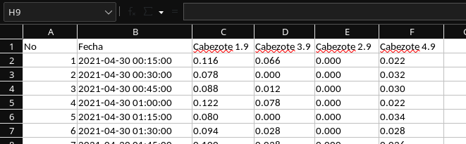

Manual
======

Para utilizar la librería ``measurement`` se debe crear un objeto de la clase
:class:`measurement.measurement.Measurement` la cual
necesitará la ruta del archivo fuente y la ruta de destino.

.. code:: python

    from measurement.measurement import Measurement

    m = Measurement('/path/to/source', '/path/to/destination/file')

Y posteriormente se puede utilizar el método :meth:`measurement.measurement.Measurement.save`
para guardar los datos. Este método retornará el nombre del archivo generado.

.. code:: python

    filename = m.save()
    print(filename)
    # output: >>> /path/to/destination/fileYYMMDD.xls

El archivo generado tendrá un parecido a este:

   Captura de pantalla de un archivo XLS generado.
